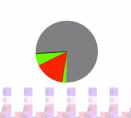
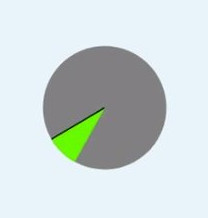
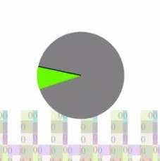

# Display Locking

## Introduction

As the quality and performance of the user-agents progresses, developers are
looking towards the web as a platform to deliver rich, visually appealing and
complex applications. In addition, these applications increasingly use
animations or designs which extend or go beyond simple scrolling and animations
of elements. Examples of this include IDE-like interfaces, infinite lists,
tabbed UIs and drawers. One of the reasons for this progression is that the web
can deliver content comparable to native applications and it allows this content
to be easily distributed to users.

However, as developers are implementing richer and more compelling applications,
they are hitting the limits of performance. Specifically, some patterns commonly
used to produce dynamic content to the user can **cause the performance of the
whole application to degrade temporarily**. For example, when a site modifies the
DOM in a way that causes expensive layout, the user experiences jank --
noticeable delay in visual updates. Note that because of the complexity of the
DOM, layouts in some areas of the page can frequently cause jank elsewhere on
the page. For instance, a script-driven animation will jank anywhere on the page
if the user agent is busy performing layout. The reason for this is that script
runs in the same event loop as layout, and browser rendering semantics require
previous layout and visual update to be done before running subsequent script.

Creating more complex applications might also mean having a **larger number of things in a web page**,
making the rendering costs of having all of the content to actually be part of the DOM
prohibitively expensive.
This drives some number of web authors to *virtualization* instead,
where they actually **refrain from putting things in the DOM**,
keeping content in memory in some non-DOM data structure,
with only the visible portion converted into DOM nodes and inserted into the document,
recycling them in and out as needed.
Popular examples include https://m.twitter.com/ and [react-window](https://github.com/bvaughn/react-window).
However, this **causes problems for the web app** because a lot of user-agent features such as find-in-page,
accessibility, indexability, focus navigation, anchor links, etc.
**depend on having the contents in the DOM**.

We propose a new concept, **display locking**, to assist developers with **alleviating
jank caused by DOM updates** and having some control on **when to pay rendering costs**,
while also **allowing things that depend on the updates to get the up-to-date values** when urgent.

In the rest of the document, we describe the display locking concept in detail.
We will first examine some motivating examples which we commonly observe in rich
web applications. We will discuss the intent of each of the examples, as well as
the areas that can potentially cause jank.
We will then move on to describe the API changes required to
implement display locking, with a description of each new functionality. With
that in place, we will revisit the motivating examples to see how display
locking can be applied in order to improve their performance. Finally, we will
discuss possible corner cases and limitations.

In order to understand the display locking proposal details, a brief explanation
of common phases in user-agent lifecycles is available [here](./lifecycle.md).
Specifically, it talks about script, layout, paint, compositing,
and presentation to the screen as well as areas that display locking is geared
to improve. 
A brief explanation of possible display locking implementations is also [available](./implementation.md).

## Motivating Examples

Consider the following example.

```html
 <style>
   #container {
    width: 100px;
    height: 100px;
    contain: content;
  }
 </style>
 <div id="container">
   <div id="complicated_subtree" style="display: none">
   ...
   </div>
 </div>

 <script>
 function presentContent() {
   let subtree = document.getElementById("complicated_subtree");
   subtree.style.display = "block";
   window.requestAnimationFrame(onContentPresented);
 }

 window.onload = function() {
   window.requestAnimationFrame(presentContent);
 };
 </script>
```

Here the content in the `complicated_subtree` is either already loaded or is
constructed at some earlier time. However, the `div` has `display: none`,
meaning that it isn’t visible and does not take up any space in the page. Then,
some event, load in this example, triggers the content to be displayed by
flipping the display property to `block`. This causes the user-agent to process
the DOM, lay it out, paint it, composite it, and present it to the screen.
However, depending on the complexity of the DOM contained in the `div`, this
process can be slow and take several frames. During this work, the page janks
causing script, rAF animations, and user input to stall and in some cases even
prevent the page from scrolling.

Let’s look at an [actual example of
this](https://drive.google.com/file/d/1Qip6D4Allotua8S6xSXzOhNolnvYPYjt/view?usp=sharing
"spinner jank"). Here, the toggle button changes the display property of the
`complicated_subtree` between `block` and `none`. We have also added a rAF
animation that records the length between the last ten requestAnimationFrame
callbacks. Note that when we switch the display property to `block`, the page
janks and the animation stops since requestAnimationFrame callbacks are not
running. After everything is laid out and is ready to be presented, the
requestAnimationFrame continues and we observe a noticeable increase in one
frame’s delay (indicated as the red slice). This delay is roughly 500ms, which
is enough to notice the animation stall.

<div style="text-align: center">
  
</div>
&nbsp;

To reiterate, this effect occurs due to the user-agent laying out content that
we want to be presented. **Even though the spinner animation is not a part of
the subtree** (it’s an iframe in this example), it still janks because **DOM
updates are atomic.**


### Common patterns

There are other common patterns that exhibit similar behavior, and as a result
suffer from similar drawbacks.

- Resizing multi-pane UI with complex layout within each pane (IDEs do this).
- Many widgets, for example YouTube: this site goes to great lengths to avoid
  long layouts, by incrementalizing their Polymer DOM updates. This is perhaps
  made trickier because Polymer uses a decentralized, widget-based update
  system.
- Latency-sensitive type/scroll with complex layout change. For example, display
  of search results as-you-type without janking the text input box.
- Expand or contract of an item with an infinite list (accordion view)
- Measuring layout, with intent of sizing containers without actually displaying
  the contents.

In general, **large-scale updates** to application state in a web app can cause
updates which **induce large document lifecycle updates**, including style, layout,
compositing, and paint. In turn, these can cause jank on the page, due to
lifecycle updates being synchronous with script and user interactions.

In a large enough web app, even small updates like window resizing or a style tweak might be expensive,
due to the **large amount of things getting affected**,
even though we might **not necessarily need every part of the web app to be up-to-date all the time**. 

In the rest of this document, we discuss display locking and how it can help
with situations like the ones mentioned above.

## Proposal: Display Locking

Using display locking, 
**web authors can control when not to pay the rendering costs for a locked subtree**,
and also **request the user-agent to do the updates in a non-janky way**.

The developer will be able to lock an element and its subtree,
preventing visual updates.
Then, the developer will be able construct the locked subtree’s DOM however they desire,
and insert it into the DOM without any rendering cost or jank.

After insertion, we can request the rendering values (style, layout, etc) to be updated.
These updates can be *co-operative* -- **interleaved with other
work such as running script or DOM updates outside of the locked subtree** if they are going to take a long time,
or calculated synchronusly if we need it.
The developer is also able to commit the element's lock,
which will calculate the rendering values if it's not up-to-date,
and cause the visual updates of the modified subtree to appear.

In essence, display locking will
make it possible to **perform complicated DOM updates without causing the rest of
the page to jank** and **only pay rendering costs on things that really need it**.

### Example code

In this example, we want to add a lot of items to a list in a non-janky way.

```html
<ul id="itemsList">
 <div>Item #1</div>
 <div>Item #2</div>
 <div>Item #3</div>
</ul>

<script>
// Add remaining items as locked.
remainingItems.forEach(item => {
  let itemEl = document.createElement("div");
  itemEl.style = "contain: style layout;";
  itemEl.displayLock.acquire({ timeout: Infinity, activatable: true, size: [100, 100] });
  itemsList.appendChild(itemEl);
 
  // We can do updates to the item's subtree without worrying about the rendering costs.
  // After we finished all the operations we can trigger a co-operative update & commit.
  // We might do this in a fancier way by not actually committing the element,
  // leaving it locked and detecting when to commit by using IntersectionObservers etc,
  // but that's out of the scope of this example :)
  itemEl.innerText = item;
  itemEl.appendChild(...);
  itemEl.firstChild.style = "...";
  doExpensiveOperationsToChildren(itemEl).then(element.updateAndCommit);
});

// Getting style/layout values within a locked subtree :
// - If we call getComputedStyle, etc. directly, it will cause a forced synchronous style update
//   (see [what-forces-layout](https://gist.github.com/paulirish/5d52fb081b3570c81e3a)).
// - We can call update() on the locked element to trigger a co-operative update and get
//   the value after the calculations finished instead.
lockedElement.displayLock.update().then(() => {
  // They're free!
  getComputedStyle(child);
  child.offsetTop;
};
</script>
```
### The locked state

#### The locked element

When its lock is acquired, the locked element itself will still be rendered and laid out normally.
Changes to the DOM, style, layout, etc of the *locked element itself* will be applied as it would on any other normal element.

##### Sizing

When locked, the locked element is treated similar to as if it has [size containment](https://www.w3.org/TR/css-contain-1/#containment-size) with some differences.

* If some style rule specifies the size of the locked element, we will use that size for the locked element.
* If there are no style rule specifying the size of the locked element, we will use the size given in the `acquire` call's options.
Instead of being treated as having no contents, the locked element will behave as if there is one child with the given *locked content size* as its intrinsic width and height, for sizing purposes.
* If there are no size specified in the `acquire` call, the locked element will not take any space, similar to `display: none` elements instead.

#### The locked subtree

When its lock is acquired, the **visual content of the nodes of flat-tree descendants of the element is cleared**, similar to `display: none`.

Changes to the *flat-tree descendants of a locked element* updates the DOM in such a way that script can inspect it immediately,
but no rendering updates wil be painted until the element is unlocked,
through `commit()` or the user-agent activating the element.

Style and layout updates can happen without unlocking the element,
through calling `update()` or triggering a *forced update* by calling style and layout inducing methods/properties
(see [what-forces-layout](https://gist.github.com/paulirish/5d52fb081b3570c81e3a)).

## API Details

### Element.displayLock

With display locking, the `Element` interface has a new attribute,
`displayLock` which returns a `DisplayLockContext` representing the display
lock. The rest of the display locking functionality happens by interacting with this
object. The `DisplayLockContext` is bound to the element from which it was
retrieved, meaning that operations on the object will affect that element.

### DisplayLockContext.acquire(options)

Acquire performs the following steps:

* Mark the source element as locked for display, preventing normal update
  phases to recurse into its flat-tree descendants.
* Finish all of the rendering update phases for the locked element, if needed.
* Clear the painted output for all of the locked element's flat-tree descendants.

It returns a promise which, when resolved, indicates that the above work has been completed.

Note that the acquire method may take options, consisting of the following key-value
pairs:
* (optional) `timeout`: `timeoutInMilliseconds`
  * This is an optional timeout value for the duration of the lock. When the
    lock is acquired, and commit is not called within `timeoutInMilliseconds`
    milliseconds, the lock will be automatically committed. This is a safety
    valve for protecting pages from inadvertently leaving an element locked
    indefinitely due to uncaught exceptions or other bugs in the code. For
    more sophisticated use cases, the value of `Infinity` will effectively disable
    the timeout.
* (optional) `activatable`: `true|false`
  * Signifies whether the user-agent can automatically commit the lock
    when the browser needs to *activate* the locked element or its descendants.
    See [element activation section](#element-activation) for more details.
  * Not setting this, or setting this to `false`,
    means this element and its descendants will be ignored in cases like
    find-in-page, anchor link navigation, focus navigation, etc.
* (optional): `size`:  `[width, height]`
   * Indicates the *locked content size* of the locked element. See [sizing](#sizing) section for more detail.
   * If not specified, the locked element will not take any space, similar to `display: none` elements.

### DisplayLockContext.locked

This is a boolean value that will be `true`
if the `Element` associated with this `DisplayLockContext` is in the locked state,
and `false` if not.

### DisplayLockContext.update()

This operation causes the lock to allow co-operative updates on the element and
its subtree in preparation for display or measuring layout. It performs the
following steps:

* The updates to rendering stages are processed as long as they do not cause
  undue delay to the rest of the update phases
* If an undue delay is likely to be caused, the work already completed is
  processed and the update phase yields to other update phases for unlocked
  content.
* Future update phases for the locked element are gated on the fact that the
  previous update phases for this locked element have completed.
* As before, when the element is painted, the changes are not visible to the
  user. Note that `update()` is free to skip doing any paint work for the
  element, since the visual state will not be displayed.
* When all of the above phases finish, the promise returned by
  `update()` is resolved, giving the script opportunity to measure layout, do
  other work, or signal to other subsystems that this element and its subtree
  are "prepared".

### DisplayLockContext.commit()

This operation causes the lock to be released and visual state of the element
and its subtree to become visible to the user. It performs the following steps:

* It allows the element and its subtree to be updated for all the rendering
  phases.
* It paints the element and ensures that the process of displaying to the user
  is started. (e.g. it sends draw commands to the compositor, or to the GPU).
* It resolves the promise returned by `commit()`, indicating that the above work
  was finished.

Note that it is OK to call `commit()` following an earlier `update()` which has
not yet resolved. This causes work that is still needed to become synchronous,
enabling the idle-until-urgent pattern.


### DisplayLockContext.updateAndCommit()

This operation combines the effects of an `update()` and a `commit()` calls:
* It causes the element to be co-operatively updated.
* When the update is finished, the element is committed resulting in visual
  updates to appear on screen.


### Element activation

When an element is locked,
there are some actions in the page that might require the element to get unlocked and be rendered to work properly.

If the browser needs to *activate* a locked element
or an element that has one or more locked ancestors,
in order to make the activated element be visible,
it will commit all locked elements in the inclusive ancestor chain of the element to be activated,
unless at least one of them is locked without the `activatable` flag set to `true`,
in which case the element can't be activated.

*Activating an element* is defined as one of the following actions:
 - `focus()` is called on the element
 - `scrollIntoView()` is called on the element
 - Tab order navigation lands on the element
 - Anchor link navigation navigates to the element
 - Find-in-page active match navigation goes to the element

For all the elements that we commit as part of element activation,
we will send a `beforeactivate` event to it just before committing.

### beforeactivate event

| property  | value  |
|---|---|
| bubbles  | true  |
| composed | false |
| target  | previously-locked ancestor |
| activatedElement  | The element that needs activation  |


Consider this tree structure:
```html
<div id="first">
 <div id="second"> <!-- locked, activatable -->
  <div id="third">
    blah
    <div id="fourth">  <!-- locked, activatable -->
     bleh
    </div>
  </div>
 </div>
<div>
```

If we need to activate `#fourth` div,
then two `beforeactivate` events will be fired.
One targeted at `#fourth` and one targeted at `#second`.
The `activatedElement` in both of them is the `#fourth` div.

If instead we need to activate `#third` div,
only one `beforeactivate` event will be fired,
at `#second` with `#third` in the `activatedElement` field.

If `#second` is actually locked with `activatable` set to false,
we can't activate anything `#second` or anything inside its subtree.
For example if `#fourth` needs activation,
even if we activate `#fourth`,
it will not be visible because `#second` is still locked.

## Requirement: Style and Layout Containment

In consideration of display locking, we have also discussed when it would and
would not be appropriate to allow an element to be locked. One main
consideration for this is containment. That is, it seems to make sense to
require that the element that is going to be locked provides containment for
style and layout. This can be achieved with the `contain: style layout;` CSS
property.

This allows us to better reason about the expected behavior of the page. Specifically,
* Layout of the locked subtree will not affect the layout of other elements
  outside of the locked element. This ensures that we can process as little or
  as much of the subtree’s layout without visually affecting the rest of the
  page.
* Finally, style of the locked subtree will not affect style of elements outside
  of the locked element. Similarly to layout containment, this ensures that we
  can process any number of elements on the locked subtree without visually
  changing the content on the rest of the page.

## Examples revisited

Let's revisit the motivating examples, modified with display locking:

```html
 <style>
#container {
    width: 100px;
    height: 100px;
    contain: content;
  }
 </style>
 <div id="container">
   <div id="complicated_subtree" style="display: none">
   ...
   </div>
 </div>

 <script>
 async function presentContent() {
   let lock = document.getElementById("container").displayLock;
   await lock.acquire({ timeout: Infinity, activatable: true });
   document.getElementById("complicated_subtree").style.display = "block";
   lock.update().then(() => { lock.commit().then(onContentPresented); });
 }

 window.onload = presentContent;
 </script>
```

Similar to the original example, on load we present the content in the
`complicated_subtree`. However, we first acquire a lock on the item and then
modify the contents. This causes the user-agent to lock the container's subtree
for visual updates. Then, we modify the DOM by setting the `complicated_subtree`
display property to `block`. Then we call `update()` and when that finishes,
`commit()`. This sequence of commands causes the user-agent to co-operatively
update the phases without introducing an undue delay for the rest of the
updates. In other words, the remainder of the page remains interactive and
animating. When the updates eventually complete, we commit and when that promise
resolves and `onContentPresented` is invoked.

Also, because we specify the `activatable` option as `true` when acquiring,
the contents of `complicated_subtree` will be considered in focus navigation,
anchor link navigation, find-in-page, etc. even when the content is not
presented yet.

As before, let’s see a [real example, this time using a prototype of display
locking](https://drive.google.com/file/d/1r1aBi4P1_DMCZNXlpzW5jAibCEdT38YB/view?usp=sharing
"spinner without jank"). When toggling display to be `block`, there is a
significantly smaller jank (yellow slice). This happens due to the prototype
implementation being incomplete (the delay is approximately 40ms).

<div style="text-align: center">
  
</div>
&nbsp;

However, other than the small jank the animation keep going, while the
user-agent lays out the content co-operatively. Note that even though the
animation is going ahead, the content is not yet presented. We can detect this
from JavaScript, by observing that the `commit()` promise has not
yet resolved.

<div style="text-align: center">
  
</div>
&nbsp;

After the user-agent completes the update phases and commit, the content is
presented without jank.

<div style="text-align: center">
  
</div>
&nbsp;

## Edge cases

There are a number of edge cases that need to be considered when working with
display locking. This section briefly lists a few of them, but the list is far
from complete.

* Subtree elements are moved in and out of the locked subtree
    * In this situation, we may have an element that is taken out of a locked
      subtree and moved elsewhere in the DOM. We think this case can be handled
      naturally, since any element added in an unlocked subtree will be
      processed by the next frame. Similarly to elements moved into locked
      subtrees, they will be processed co-operatively regardless of their
      origin.
* Locked element is moved around on the page.
    * In this situation we simply move the whole locked element around the DOM.
      This case should also be handled naturally, since the subtree will be
      processed co-operatively. Containment restriction also alleviates concerns
      about other elements changing as a result.
* Locked element in a locked subtree.
    * In this situation we have a locked element, which itself is located
      within a locked subtree. There’s a question of how to budget this
      correctly. It is possible that we just use a single budget for all of the
      subtree, even if some elements are themselves locked. It is also possible
      that we only process innermost locked subtree first. There are likely some
      other options here, but overall it doesn’t seem to be a blocking issue.
* Multiple locked elements.
    * Similar to above, this case simply has multiple locked elements on the
      page. Conceptually we should use a single budget for all of the locked
      elements on the page, to prevent jank. It is also possible that each
      subtree gets an independent budget to ensure forward progress on all
      elements, but at the cost of jank induced by the total budget exceeding
      the length of a frame.
* Querying layout inducing properties in a locked subtree.
    * This is the most worrying case. We may query things such as size and
      offset from an element in a locked subtree. Since the layout isn’t
      guaranteed to be finished for the elements queried, it is unclear what is
      the best course of action here. One possibility is to force layout for the
      queried element and, possibly, its ancestors and descendants, depending of
      what is required to get the queried information. Another possibility is to
      simply disallow such queries into the locked subtree, failing with an
      invalid number returned.

Display locking will certainly have edge cases that need to be considered, some
of which we have listed here. The general feeling is that the edge cases are
tractable and, given the benefits of the feature, should not block progress on
its implementation.

## Discussion

Let’s briefly touch on two aspects of web standards that are important for new
features: ergonomics and interoperability.

Ergonomics is a concern for easy of usability of the feature. Display locking
leverages a notion of a lock, which is common in threaded programming. In
typical threaded programming, a lock restricts access to data for one thread:
the thread that owns the lock. Display locking extends the notion by restricting
access to visual representation of the locked subtree. In other words, the
visual representation of the content is only accessible by the co-operative
updates. It is not accessible by a system that draws the content to the screen.
Hence, with the addition of three functions and leveraging known concepts,
display locking is a simple and straightforward API that alleviates jank due to
user-agent update phases. As demonstrated by the example above, the burden of
code complexity is also minimal.

Interoperability is another important aspect of new features. This is a concern
for cross browser support of new proposed features. Since display locking is
largely a performance API, it can be stubbed out for the most part by only
preventing the browser from displaying new content. The layout and other update
phases can still be non-co-operative. The co-operative updates can be
incrementally implemented in user-agents. As for the web developers, the feature
detection of `getDisplayLock` is also simple. If it is present, the developer
can wait on the lock acquisition and commit. Otherwise, the developer simply
updates the DOM in the same way as before. This makes this feature easy to adopt
and, in case of problems, deprecate.
