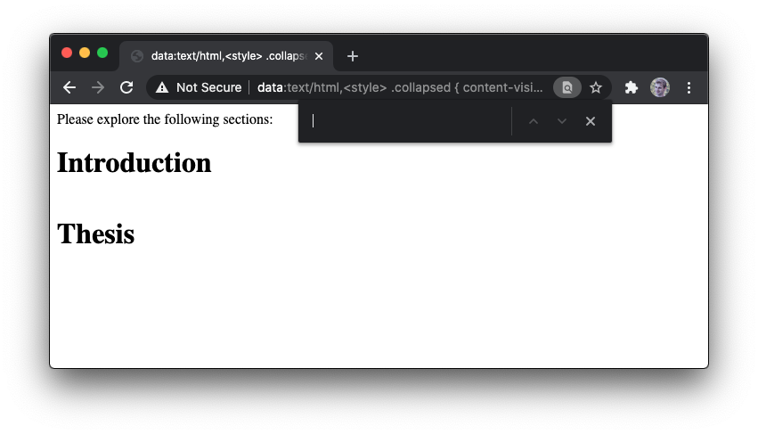
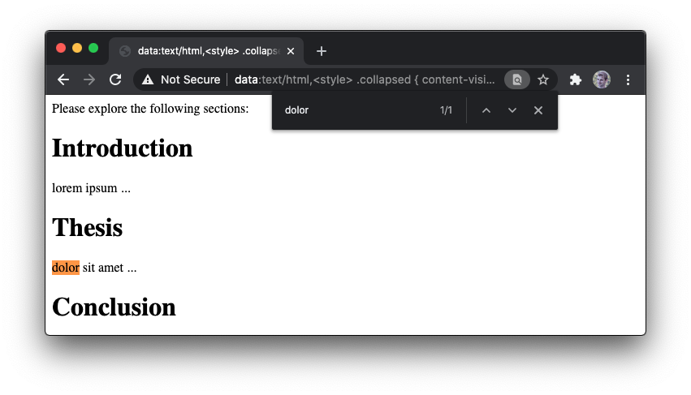

# The `beforematch` event

### Summary (TL;DR)

The `beforematch` event allows developers to display content to the user in
response to actions which scroll the page to a target element. It is fired
at render timing just before these actions scroll the page. The applicable
actions are the following:

* There is a new find-in-page (ctrl+f) active match, in which case the event
  is fired with the matched element as the target.
* There is an element fragment navigation (`example.com/#foo`) or the fragment
  is changed by script (`window.location.hash = ...`), in which case the event
  is fired with the matched element as the target.
* There is a [scroll-to-text](https://github.com/WICG/ScrollToTextFragment)
  navigation (`example.com/#:~:text=foo`), in which case the event is fired with
  the matched element as the target.

Note that the 'matched element' in this document refers to one of the following:
* In the find-in-page and scroll-to-text cases: The closest block-level ancestor
  element in the flat tree containing the matching text.
  If the match spans multiple block-level elements, then the first block-level
  element is used.
  Since the flat tree is used to determine the element to fire the event on,
  shadow boundaries have no impact.
* In the element fragment case: The element which was selected by id from the
  fragment.

The use case for this event is to allow developers to help users find hidden
content on the page. Hidden content includes collapsed sections via clipping,
`visibility: hidden` subtrees, and [`content-visibility:
hidden-matchable`](https://github.com/WICG/display-locking) subtrees.

### Motivation

With the evolution of the web, there are always new and interesting ways that
developers choose to organize the information on their pages. Some of these
approaches (e.g. the common case of text scrolling), lend themselves naturally to
user-agent features like find-in-page. This is not an accident, since
find-in-page was designed with common use-cases in mind.

However, other approaches like collapsed sections of text do not work well with
user-agent features since the page does not get any indication that the user
initiated a find-in-page request, fragment navigation, or scroll-to-text
navigation.

The `beforematch` event is a step in the direction that allows developers to
leverage information that the user-agent already has to make these search and
navigation experiences great. Specifically, with [hidden but
matchable](#footnotes) content, it will be possible to process text for
find-in-page match in sections that are not visible. In turn, the `beforematch`
event will be fired on hidden (a.k.a. collapsed) sections, allowing the
developer to unhide the section. The net effect is that the user is able to use
find-in-page or link navigation to find content in collapsed sections --
something that is not currently possible.

Even without hidden but matchable features, `beforematch` is a useful signal to the
page which allows custom styling of the matched element, which is now only
possible with approximations from scroll positions and intersection
observations.

### Use Cases

#### Example 1: Expanding `hidden-matchable`
```html
<style>
.collapsed {
  content-visibility: hidden-matchable;
}
.title-collapsed::before {
  content: '➡';
}
.title-open::before
  content: '⬇';
}
</style>

Please explore the following sections:
<div class=section>
  <h1 class="title-collapsed">Introduction</h1>
  <div class=collapsed>lorem ipsum ...</div>
</div>

<div class=section>
  <h1 class="title-collapsed">Thesis</h1>
  <div class=collapsed>dolor sit amet ...<div>
</div>

<div class=section>
  <h1 class="title-collapsed">Conclusion</h1>
  <div class=collapsed>consectetur adipiscing ...</div>
</div>

<script>
document.querySelectorAll('.section').forEach(section => {
  const title = section.querySelector('.title-collapsed');
  const hiddenContent = section.querySelector('.collapsed');
  section.addEventListener('beforematch', () => {
    hiddenContent.classList.remove('collapsed');
    title.classList.remove('title-collapsed');
    title.classList.add('title-open');
  });
});
</script>
```





In this example, most of the content of the page is hidden in collapsed sections.
It uses the upcoming `content-visibility` CSS property to hide the
content while letting it be searchable by find-in-page. When a match is found,
and `beforematch` event is fired, we expand the section by removing the
collapsed class.

Note that the net effect of this is that the user is able to find matches in
collapsed sections which are automatically expanded. This is possible due to
both hidden-but-matchable content and the `beforematch` event.

The same effect occurs when doing a fragment link navigation to any element
within the collapsed section. Likewise, scroll-to-text navigation would expand
relevant sections. For instance, navigating to
`example.com/page.html#:~:text=lorem` would expand the introduction section by
observing the `beforematch` event for that section as a result of the
scroll-to-text fragment navigation match.

One possible real-world application of this is the collapsed sections on mobile
wikipedia pages. find-in-page and scroll-to-text currently can't find text inside
of the collapsed sections, but with beforematch and content-visibility they
could be searchable and automatically expanded.

Also note that developer adoption of the `beforematch` event in these use-cases should be
straight-forward, since the typical page that provides content in collapsed
sections already has an event handler to expand and show the section. With the
`beforematch` event, we can reuse the same handler to expand the section.

#### Example 2: Animating matches

```html
<style>
.section {
  transition: background 2s;
}
.highlighted {
  background: cornsilk;
  transition: background 0s;
}
</style>

<div class=section>Lorem ipsum dolor sit amet</div>
<div class=section>consectetur adipiscing elit</div>
<div class=section>Sed augue lacus</div>

<script>
function highlight(e) {
  e.target.classList.add("highlighted");
  requestAnimationFrame(
    () => requestAnimationFrame(
      () => e.target.classList.remove("highlighted")));
}

document.querySelectorAll(".section").forEach(item => {
  item.addEventListener("beforematch", highlight);
});
</script>
```

In this example, a highlighted entry gains a corksilk background color, which
fades over approximately two seconds. It's a subtle effect that grabs the user's
attention but is not too intrusive. 

We use a `beforematch` event to highlight the section. Note that the highlighted
element is the target element of the `beforematch` event, but we can also modify
any related style or DOM based on the target's location.

The highlighting, and any other effect added by the developer, happens in
addition to the user-agent highlighting the found match.

#### Example 3: Expanding `<details>`

```html
<details id=details>
  <summary>Click or search to expand</summary>
  Hidden inner text
</details>

<script>
details.addEventListener('beforematch', () => details.open = true);
</script>
```

In this example, the beforematch event opens the `<details>` element to reveal
the text the user was searching for. In the existing behavior without
beforematch, it isn't possible to search for text inside a closed `<details>`
element.

### Privacy Concerns

Note that this event exposes more information to the page than would otherwise
be available. In particular, the page can know which section of text was found
using find-in-page, fragment navigation, and scroll-to-text navigation.

The developer may also be able to find out some information about what the user
typed into a find-in-page dialog based on which elements receive an event.
Likewise, for scroll-to-text navigation, the developer may be able to learn more
about the content of the fragment search terms based on which section of the
page receives an event.

We believe that the benefit of providing this information to the site outweighs
the potential risks. Moreover, the lower granularity information can already be
approximated from scroll position and intersection observerations on the page.

There are three cases to consider, each of which correspond to an action that
caused the `beforematch` event to be fired:
1. Find-in-page. The data typed into the search dialog for find-in-page is not
   directly observable by the page. However, based on the `beforematch` event, the page
   can infer that the searched text is within a particular element that received
   the event. We believe that the risk of exposing this information to the page
   is low:
     * The granularity of information provided is low, since the event is
       received by the containing element, and does not reveal the actual text
       searched.
     * Find-in-page shortcuts (such as CTRL-F) can already be intercepted by the
       page, giving it opportunity to intercept user-typed "find-in-page"
       requests and provide custom behavior.
     * The position of the searched text can already be deduced by the page
       based on scroll offsets and intersection observations.
2. Anchor or fragment link navigation. This information is already available to
   the page via parsing of the URL string, so no new information is provided by
   the `beforematch` event.
3. Scroll to text navigation. Depending on the implementation of scroll-to-text,
   from the page's perspective the behavior is indistinguishable from
   find-in-page behavior. This means that it reveals where the searched text is
   located but not what it is. Furthemore, this information is only available to
   the page using the `beforematch` event, and is not observable by any third
   parties.

Some consideration needs to be given to the `beforematch` event when it comes to
cross frame interactions. Specifically, if the matched information is found within
a frame, should the signal propagate to the embedding page?

In general, we believe that the `beforematch` event does not pose a privacy problem.
However, the privacy aspect of the event should be discussed in more detail via
formal security reviews.

### Responses to DOM and style changes in the `beforematch` event handler

The scrolling behavior exhibited by find-in-page, ScrollToTextFragment, and
ElementFragment after style and DOM changes are made by `beforematch` event
handlers is not well specified yet and is being discussed here: 
https://github.com/WICG/display-locking/issues/150

Here is a list of `beforematch` handler use cases that could affect scrolling:
1. **Removed from DOM**: The `beforematch` event handler removes the
target element from the DOM.
2. **Reparented in DOM**: The `beforematch` event handler removes the target
element from the DOM, and re-adds it further down the tree such that the
location to scroll to is different.
3. **display: none**: The `beforematch` event handler adds the style
`display: none` to the target element.
4. **visibility: hidden**: The `beforematch` event handler adds the style
`visibility: hidden` to the target element.
5. **content-visibility: hidden-matchable -> visible**: The target element has
the style `content-visibility: hidden-matchable` before the `beforematch` event
is fired on the target element, and the `beforematch` event handler changes the
style value from `hidden-matchable` to `visible`.


Here is the current scrolling behavior in Chromium for each of those cases in
ScrollToTextFragment, and ElementFragment, and find-in-page. As mentioned
before, this is still being discussed
[here](https://github.com/WICG/display-locking/issues/150) and is subject to
change.

#### ScrollToTextFragment
1. **Removed from DOM**: ScrollToTextFragment will not scroll to the removed
element. If there is a second match which is still in the DOM after
beforematch, it will be scrolled to but a second beforematch event will not be
fired.
2. **Reparented in DOM**: ScrollToTextFragment will scroll to the new
location of the target. If there is a second match which was not reparented,
ScrollToTextFragment will scroll to whichever comes first from the top of the
page after the beforematch event is fired.
3. **display: none**: ScrollToTextFragment will not scroll to the target
element. If there is a second match which was not modified, ScrollToTextFragment
will scroll to it.
4. **visibility: hidden**: ScrollToTextFragment will not scroll to the target
element. If there is a second match which was not modified, ScrollToTextFragment
will scroll to it.
5. **content-visibility: hidden-matchable -> visible**: ScrollToTextFragment
will scroll to the unlocked text.

#### ElementFragment
This is the behavior both when navigating to a page with an element fragment in
the url and when assigning to `window.location.hash`.
1. **Removed from DOM**: The page will not scroll.
2. **Reparented in DOM**: The page will scroll to the target element's new
location.
3. **display: none**: The page will not scroll.
4. **visibility: hidden**: The page will scroll to the target element. This
behavior makes sense because it matches the behavior when targeting a
`visibility: hidden` element with a fragment regardless of beforematch.
5. **content-visibility: hidden-matchable -> visible**: The page will scroll
to the newly painted element.

#### find-in-page
The find-in-page behavior has some issues in these cases. These will likely
be fixed after adding an async step to pick up layout changes made by the
beforematch event listener. Here is a bug to track this work:
https://bugs.chromium.org/p/chromium/issues/detail?id=1074121
1. **Removed from DOM**: find-in-page does not scroll to the target element. If
there is a second match in the DOM, find-in-page will find it and scroll to it
without needing additional user input.
2. **Reparented in DOM**: If the only match in the document is reparented to the
end of the document, find-in-page becomes stuck at "0/x" matches and can't
scroll to the new location, even if you keep typing more of the match out or
close and reopen find-in-page. This behavior is obviously not good, and
hopefully will be fixed by adding an async step to get updated layout
information. If there is a second match in the DOM which is not reparented,
the page will scroll but find-in-page will still get stuck.
3. **display: none**: find-in-page will scroll to the spot the element used to
take up. This should probably not scroll at all instead, and will hopefully
happen after adding an async step to get updated layout information. If there
is a second match, the page will scroll to the second match.
4. **visibility: hidden**: find-in-page will scroll to the spot the element used
to take up. This should probably not scroll at all instead, and hopefully won't
scroll after adding an async step.
5. **content-visibility: hidden-matchable -> visible**: find-in-page scrolls to
to the revealed text.

### Alternatives
Given the purpose of displaying `content-visibility: hidden-matchable` text
when it is searched for, there are a number of alternatives we have considered.

#### Automatic Unlocking
`content-visibility: hidden-matchable` text would automatically become visible
when searched for by adding an internal flag to the `hidden-matchable` element
saying that it has been "unlocked."
##### Pros
* Provides the desired behavior without the need for the web developer to do
  anything besides use the `hidden-matchable` value.
* Since there is no event causing script to run, the interaction and scrolling
  occurs entirely within the browser, which guarantees that we can scroll to
  the element without complications.
##### Cons
* Doesn't allow the developer to change other properties in conjunction with
  displaying hidden content. For example, in "Example 1: Expanding
  `hidden-matchable`," automatic unlocking wouldn't be able to change the
  style of the `<h1>` title elements.
* Doesn't allow "unlocked" `hidden-matchable` content to become hidden again,
  which could get confusing.
* Automatic unlocking and adding internal hidden state to track unlocked
  `hidden-matchable` sections gets complicated and confusing in the browser.

#### Automatic Unlocking without internal state
`content-visibility: hidden-matchable` text would automatically be changed
to `content-visibility: visible` by modifying `element.style` when text inside
it has been searched for.
##### Pros
* Same pros as "Automatic Unlocking."
* Don't need to maintain internal state in the browser.
* If a developer knows how it works, they can change the style back to
  `content-visibility: hidden-matchable`.
##### Cons
* May require modifying `element.style` of multiple elements.
* If script later modifies `element.style`, then the matching text would become
  invisible again. In general, having the browser change DOM or style like this
  isn't a good idea because it would be likely to clash with how the page is
  maintaining the same state.

#### Automatic Unlocking with activation event
This is like "Automatic Unlocking," but with an added "activation" event emitted
when content is displayed to allow developers to change other state and styles
if needed.
##### Pros
* Same pros as "Automatic Unlocking."
* Allows other script state and styles to be changed when content is displayed.
##### Cons
* Doesn't allow "unlocked" `hidden-matchable` content to become hidden again,
  which could get confusing.
* Automatic unlocking and adding internal hidden state to track unlocked
  `hidden-matchable` sections gets complicated and confusing in the browser.

#### CSS Pseudo Selector
A pseudo selector, such as `:target`, would be applied to the element
containing the matching text when it is searched for. This pseudo selector
could be applied to the entire ancestor chain.
##### Pros
* Allows content to become visible when searched for with only CSS.
* Allows other styles to be changed when the content is displayed.
##### Cons
* If CSS with a pseudo selector is used to make text visible, then when
  find-in-page is closed or the search text changes, the pseudo selector would
  be removed and then any selector which is displaying the text based on that
  pseudo selector would not apply, causing the expanded section to unexpectedly
  collapse.
* There is no way in CSS to say "change my style if a descendant has a pseudo
  class on it." For this reason, developers would be unable to change styles
  outside of the particular element that has the matching text, which would
  make the functionality of "Example 1: Expanding `hidden-matchable`" not
  possible. Although this could be mitigated for some cases by applying the
  pseudo selector to the entire ancestor chain, it can be complicated or
  impossible to provide the right selector which can modify a style on an
  unrelated element.

### Footnotes

**Hidden but matchable** content refers to an idea that although some content
may be hidden from the user, it may still be useful to have that content be
searchable.  One such approach is [`content-visibility:
hidden-matchable`](https://github.com/WICG/display-locking), but there are
other ways to achieve hiding, for example via `overflow: hidden` plus `height: 0px`.
