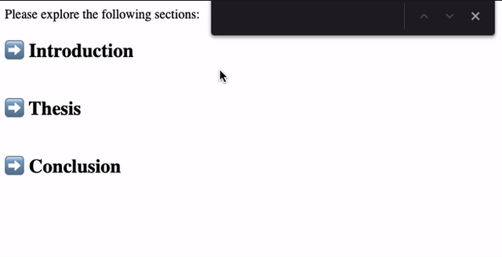

# The `hidden=until-found` HTML attribute and the `beforematch` event

## Summary (TL;DR)

This is an explainer for two coupled features:

1. The `hidden=until-found` HTML attribute. This uses the string `until-found`
   as a value for the existing `hidden` HTML boolean attribute. When this
   special string is used as the value for the `hidden` attribute, the browser
   will make that content searchable to user-agent algorithms such as
   find-in-page. When the browser wants to scroll this hidden content into view,
   the browser will automatically remove the `hidden` attribute from the element
   to reveal it.

2. The `beforematch` event is fired before the browser removes the
   `hidden=until-found` attribute to allow the page to change other state in
   conjunction with the removal of the `hidden` attribute and the browser
   scrolling.

The browser should fire `beforematch` on the `hidden=until-found` element and
then remove the `hidden=until-found` attribute at render timing for these cases:
* There is a new find-in-page
  [active match](https://html.spec.whatwg.org/multipage/interaction.html#fip-matches)
  which is located inside an element with the `hidden=until-found` attribute.
* There is a [scroll-to-text](https://github.com/WICG/ScrollToTextFragment)
  navigation (`example.com/#:~:text=foo`), where the target text is located
  inside a `hidden=until-found` element.
* There is an element fragment navigation or change (`example.com/#foo`),
  where the target is the element whose id matches the id in the fragment.
* [`window.find`](https://developer.mozilla.org/en-US/docs/Web/API/Window/find)
  found a text match located inside a `hidden=until-found`
  element. We aren't certain if `window.find` will be supported for sure
  yet, see the detailed section about it below.

If the matching text spans multiple `hidden=until-found` ancestors, only the
first `hidden=until-found` will be removed and the `beforematch` event will only
be fired on the first one.

If there are multiple `hidden=until-found` elements in the flat tree ancestor
chain of the target element to reveal, then all of them will be removed and all
of them will receive the `beforematch` event.

Note that the proposal for `hidden=until-found` and `beforematch` is still in
review and is subject to change.

## Motivation

With the evolution of the web, there are always new and interesting ways that
developers choose to organize the information on their pages. Some of these
approaches (e.g. the common case of text scrolling), lend themselves naturally to
user-agent features like find-in-page. This is not an accident, since
find-in-page was designed with common use-cases in mind.

However, other approaches like collapsed sections of text do not work well with
user-agent features since the page does not get any indication that the user
initiated a find-in-page request, or scroll-to-text navigation.

`hidden=until-found` and the `beforematch` event is a step in the direction that
allows developers to leverage information that the user-agent already has to
make these search and navigation experiences great. Specifically, it makes it
possible to process text for find-in-page match in sections that are not
visible. In turn, `hidden=until-found` sections will be made visible, allowing
the user to use find-in-page or link navigation to find content in collapsed
sections -- something that is not currently possible.

## Primary use case: collapsed searchable sections
```html
<!DOCTYPE html>
<meta charset="utf-8">

<style>
.title {
  cursor: pointer;
}
.title::before {
  content: '⬇️ ';
}
[hidden=until-found] > .title::before {
  content: '➡️ ';
}

.details {
  margin-left: 20px;
}
</style>

Please explore the following sections:
<div hidden=until-found class=section>
  <h2 class=title>Introduction</h1>
  <div class=details>lorem ipsum ...</div>
</div>

<div hidden=until-found class=section>
  <h2 class=title>Thesis</h1>
  <div class=details>dolor sit amet ...</div>
</div>

<div hidden=until-found class=section>
  <h2 class=title>Conclusion</h1>
  <div class=details>consectetur adipiscing ...</div>
</div>

<script>
document.querySelectorAll('.section').forEach(section => {
  section.querySelector('.title').onclick = () => {
    if (section.hasAttribute('hidden') {
      section.removeAttribute('hidden');
    } else {
      section.setAttribute('hidden', 'until-found');
    }
  };
});
</script>
```



As you can see in the above gif, the flow of the use case is as follows:
1. The page loads and all subsections are hidden with only the headings visible,
similar to a `<details>` element.
2. User searches for hidden text, such as "lorem ipsum".
3. The browser removes the `hidden=until-found` attribute on the element
   containing the text "lorem ipsum".
4. User may click on the section to collapse it again.

In this example, most of the content of the page is hidden in collapsed
sections.  It uses the `hidden=until-found` HTML attribute to hide the content
while letting it be searchable by find-in-page. When a match is found, the
browser automatically expands the section by removing the `hidden` attribute.

Note that the net effect of this is that the user is able to find matches in
collapsed sections which are automatically expanded.

The same effect occurs when scroll-to-text navigation targets text in a hidden
section. For instance, navigating to `example.com/page.html#:~:text=lorem` would
make the browser expand the introduction section as a result of the
scroll-to-text fragment navigation match.

One possible real-world application of this is the collapsed sections on mobile
wikipedia pages. find-in-page and scroll-to-text currently can't find text
inside of the collapsed sections, but with `hidden=until-found` they could be
searchable and automatically expanded.

Using this feature is a good optimization for low power mobile devices that
don't want to render all of the content in the page but still making it
accessible to features such as find-in-page. Making long articles with collapsed
sections accessible to find-in-page will improve the user experience.

## The `beforematch` event and other use cases

The previous example doesn't need to use the proposed `beforematch` event
because all other visual state in the example is controlled with HTML attribute
selectors in CSS. However, we should still notify the page that something is
being revealed via the `beforematch` event. More complex use cases include
carousels and tabs, where the revealing of one section means that the page must
also hide another corresponding section, perhaps by applying the
`hidden=until-found` attribute, in a `beforematch` event handler.

## Comparison to the `<details>` element

The [auto-expanding `<details>`
feature](https://github.com/whatwg/html/pull/6466) works very similarly to this
feature. This feature empowers developers to build their own auto-expandable
details elements and more by exposing the primitive features used to make the
auto-expandable `<details>` element.

## Privacy concerns

The `beforematch` event as well as the DOM modifications made by the browser
when it removes the `hidden` attribute expose additional information to the page
about find-in-page and ScrollToTextFragment.

For find-in-page, this new information no more exploitable than the existing
`scroll` events. It is already possible to snoop on find-in-page by creating a
scrollable area containing every next character the user could type into
find-in-page, listening to scroll events to see which caracter the user typed
in, then prepending the new character to all of the next possible search terms.
If the scrollable area is 1px tall or otherwise very small or hard to see, then
the user may not be able to tell it is happening. This is demonstrated in
[search-incremental.html](/resources/find-in-page/search-incremental.html).

In order to mitigate find-in-page snooping from both `scroll` events and
`hidden=until-found`/`beforematch`, browsers should avoid scrolling to every
character the user types into the find-in-page dialog by adding a delay between
keystrokes and scrolling. This prevents the page from incrementally building the
user's search query one character at a time. If a snooping page has to build the
user's search query at something like 5 characters at a time, the page would
need to include so many potential results that it would become very hard or
impossible to recreate the user's search query.

As for the ScrollToTextFragment case, the browser firing the `beforematch` event
and removing the `hidden` attribute on the target text does not reveal more
information than is already revealed by the exising scrolling and `:target`
pseudo selector that ScrollToTextFragment applies.

## Responses to DOM and style changes in the `beforematch` event handler

If the `beforematch` event handler
[collapses](https://dom.spec.whatwg.org/#range-collapsed) the DOM range of the
target text or changes the style to remove the target text from rendering, the
browser will not scroll to the target text.

## Usage of `content-visibility`

`hidden=until-found` will be implemented as a presentational style of
`content-visibility:hidden` as opposed to the existing `hidden` attribute which
applies a presentational style of `display:none`. This will improve the
performance of searching the content inside the `hidden=until-found` subtree
because searching for text in these areas requires computing style and layout.
`content-visibility` saves this computed style and layout instead of
`display:none` which deletes them, which means that once the first run of
find-in-page or ScrollToTextFragment will compute these values, and subsequent
runs can reuse the saved style and layout.

## Accessibility

`hidden=until-found` subtrees will not be included in the accessibility tree
because they internally use `contenet-visibility:hidden`.

Websites are encouraged to provide a way to reveal `hidden=until-found` content
without the use of find-in-page, ScrollToTextFragment, or element fragment
navigation in order to ensure that all users can access the hidden content, like
the clickable/activatable label to expand a `<details>` element.

## Supporting `window.find()`

Another potential user-agent algorithm we could add beforematch to is
`window.find`. `window.find` works very similarly to find-in-page and exists in
Firefox, Safari, and Chrome, but is not specified and has rather low usage. The
only benefit I see to adding support to `window.find` would be to make it easier
to add WPT tests for beforematch, since we cant have WPTs for find-in-page.
However, that would also require speccing `window.find`.

## Backwards compatability with the `hidden` attribute

If a browser which doesn't implement this feature renders a `hidden=until-found`
element, it will still apply the `display:none` style from the `hidden`
attribute, which will still make the element hidden like the
`content-visiblity:hidden` style that `hidden=until-found` is supposed to apply.
This means that websites won't need to specially consider support for this
feature between browsers, it just means that find-in-page and
ScrollToTextFragment won't work as nicely in the browsers which don't support
it.

## Alternatives considered
Given the purpose of displaying `hidden=until-found` text when it is searched
for, there are a number of alternatives we have considered.

### Use a CSS property instead of an HTML attribute
Instead of having the `hidden=until-found` HTML attribute, we could have a CSS
property named `content-visibility: hidden-matchable`. In order to reveal the
content in response to find-in-page or ScrollToTextFragment, the `beforematch`
event handler would need to manually remove the `content-visibility:
hidden-matchable` property. [This was proposed as a prior iteration of this
feature](https://github.com/w3c/csswg-drafts/issues/5595).
```html
<style>
.hidden {
  content-visibility: hidden-matchable;
}
</style>
<div id=mydiv class=hidden>
  hello world
</div>
<script>
mydiv.addEventListener('beforematch', () => {
  mydiv.classList.remove('hidden');
});
</script>
```
#### Pros
* Having visibility be controlled by a CSS property makes more sense.
* It's harder to apply an attribute to a lot of content at once than it is to
  apply a CSS property to a lot of content at once. CSS is more ergonomic.
* If you have a custom element which wants to apply hidden-matchable to its
  light DOM children, you can easily do so with a CSS selector which doesn't
  actually modify the state of the light DOM children. With this attribute, you
  would have to modify the light DOM children.
#### Cons
* Requires script to reveal hidden content instead of having the browser do it
  automatically. This makes it easier to use and harder to implement poorly for
  web developers.
* If the page takes too long to reveal the hidden content, such as in the case
  of asynchronously applying styles, the browser won't be able to scroll to the
  target text.

*Note: the following alternatives were written as alternatives to the previously
proposed `content-visibility: hidden-matchable` CSS property and might not make
as much sense as alternatives to the proposed `hidden=until-found` HTML
attribute.*

### Automatic revealing with internal state
Instead of having an HTML attribute, this feature would be implemented as a CSS
property which automatically reveals itself in response to find-in-page by
setting an internal flag on elements which are considered active by
find-in-page. This used to be implemented in Blink as a prior iteration of this
feature.
#### Pros
* The browser reveals the content and scrolls to it without the need for any
  script.
* Since there is no event causing script to run, the interaction and scrolling
  occurs entirely within the browser, which guarantees that we can scroll to
  the element without complications.
* Less privacy concerns since the browser doesn't explicitly signal new
  information to the page when a match is found or revealed.
#### Cons
* Doesn't allow the page to change other state in conjunction with displaying
  hidden content. For example, the html example earlier in this explainer uses
  the beforematch event to change the arrow in the clickable title section which
  expand and collapses the section to show whether or not the section is
  expanded or collapsed. This is a very common pattern, and without the page
  being notified about the reveal, it isn't possible.
* Doesn't make it feasible for script to toggle the expanded/collapsed state
  since script can't see the internal flag representing the expanded/collapsed
  state.
* Automatic revealing and adding internal hidden state to track revealed
  sections gets complicated and confusing in the browser implementation.

### Automatic revealing with `element.style`
Instead of having an HTML attribute, this feature would be implemented as a CSS
property which would automatically get overwritten by the browser via
`element.style` or something similar when the content should be revealed.
#### Pros
* The browser reveals the content and scrolls to it without the need for any
  script.
* Since there is no event causing script to run, the interaction and scrolling
  occurs entirely within the browser, which guarantees that we can scroll to
  the element without complications.
* Don't need to maintain internal state in the browser.
* If a developer knows how it works, they can change the style back to hidden.
#### Cons
* May require modifying `element.style` of multiple elements.
* If script later modifies `element.style`, then the matching text would become
  invisible again. In general, having the browser change DOM or style like this
  isn't a good idea because it would be likely to clash with how the page is
  maintaining the same state and isn't very intuitive to the developer.
* Doesn't make it easy for the page to change other state in conjunction with
  the reveal.
* Requires privacy mitigations since the reveal/match is observable by the page.

### Automatic revealing with activation event
This is like "Automatic Revealing," but with an added "activation" event emitted
when content is revealed to allow the page to change other state and styles if
needed.
#### Pros
* The browser reveals the content and scrolls to it without the need for any
  script.
* Allows script to modify state and style when content is revealed.
#### Cons
* Doesn't make it feasible for script to toggle the expanded/collapsed state
  since script can't see the internal flag representing the expanded/collapsed
  state.
* Automatic revealing and adding internal hidden state to track revealed
  sections gets complicated and confusing in the browser implementation.
* Requires privacy mitigations since the reveal/match is observable by the page.

### CSS pseudo selector
A pseudo selector, such as `:target`, would be applied to the element
containing the matching text when it is searched for. This pseudo selector
could be applied to the entire ancestor chain.
#### Pros
* Allows content to become visible when searched for with only CSS.
* Allows other styles to be changed when the content is displayed.
#### Cons
* If CSS with a pseudo selector is used to make text visible, then when
  find-in-page is closed or the search text changes, the pseudo selector would
  be removed and then any selector which is displaying the text based on that
  pseudo selector would not apply, causing the expanded section to unexpectedly
  collapse.
* There is no way in CSS to say "change my style if a descendant has a pseudo
  class on it." For this reason, developers would be unable to change styles
  outside of the particular element that has the matching text, which would make
  the functionality of Example 1 not possible. Although this could be mitigated
  for some cases by applying the pseudo selector to the entire ancestor chain,
  it can be complicated or impossible to provide the right selector which can
  modify a style on an unrelated element.
* Requires privacy mitigations since the reveal/match is observable by the page.
* Not elegant or not even possible for script to listen for the reveal and
  change other state in the page.
