# Find-in-page compatibility across browsers

This page documents similarities and differences across browsers when using the browser find-in-page UI in different situations.

## Browsers tested

The test was conducted on the following browsers:
* Chrome Canary 85.0.4164.0
* Firefox Nightly 79.0a1
* Safari Technology Preview Release 107 (Safari 13.2, WebKit 15610.1.14.1)

## Tests

### Display Types

This test checks whether find-in-page crosses the boundary of different display
types: block, inline-block, and inline.

```html
<!doctype html>

<style>
.block { display: block }
.inlineblock { display: inline-block }
.inline { display: inline }
</style>

<p>The following two words are in separate blocks:</p>
<div class=block>one</div><div class=block>two</div>

<p>The second word is in a block sibling of the first:</p>
<div class=block>one<div class=block>two</div></div>

<p>The following two words are in separate inline-blocks:</p>
<div class=inlineblock>one</div><div class=inlineblock>two</div>

<p>The second word is in a inline-block sibling of the first:</p>
<div class=inlineblock>one<div class=inlineblock>two</div></div>

<p>The following two words are in separate inlines:</p>
<div class=inline>one</div><div class=inline>two</div>

<p>The second word is in a inline sibling of the first:</p>
<div class=inline>one<div class=inline>two</div></div>
```

Searching for "onetwo" without quotes.

#### Chrome results

<kbd>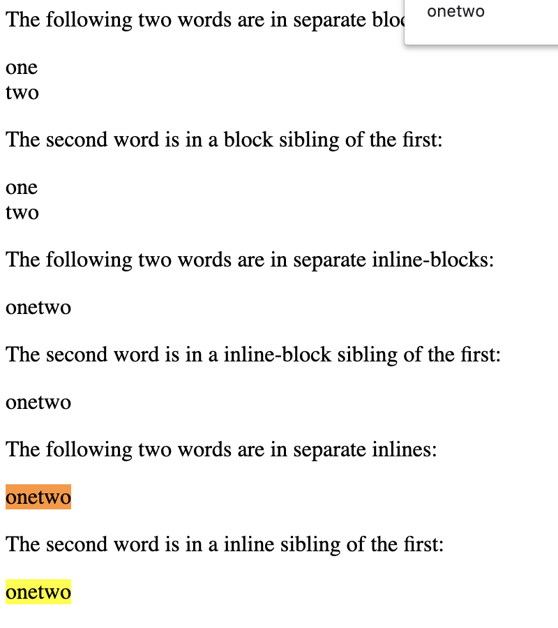</img></kbd>

Chrome finds text in separate inlines, and when the second word is an inline
sibling of the first. It does not find the text in any other cases.

#### Firefox results

<kbd>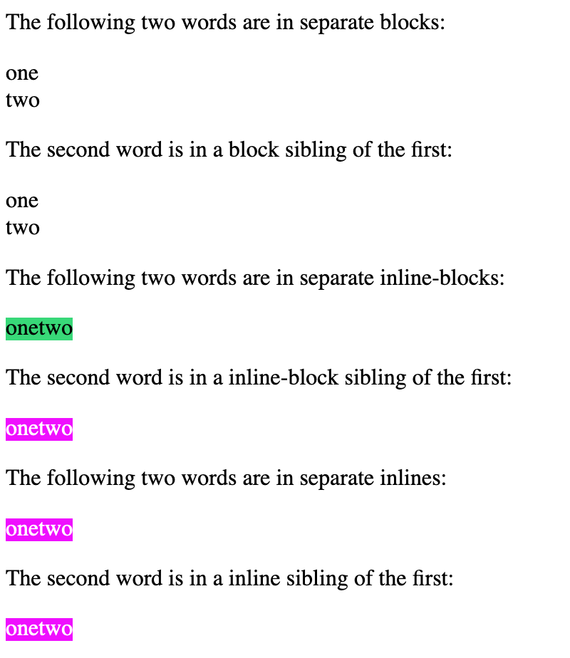</img></kbd>

Firefox finds text in separate inlines, separate inline-blocks, and
corresponding sibling tests. It does not find text across blocks.

#### Safari results

<kbd>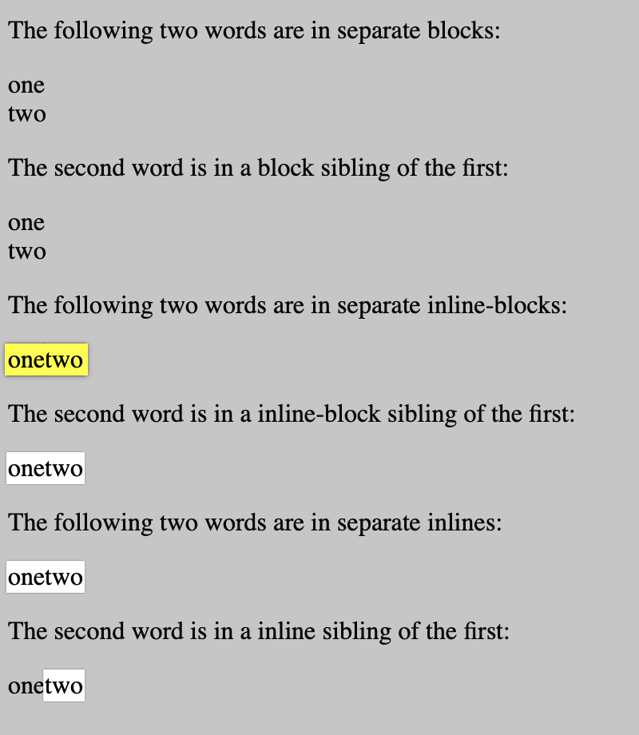</img></kbd>

Safari finds text in separate inlines, separate inline-blocks, and
corresponding sibling tests. It does not find text across blocks. Note that
there is a visual highlight inconsistency: in one of the cases only the second
word is highlighted.

### Visibility

This test checks whether matches are found in content that is hidden by
different means: visibility hidden, display none, opacity 0, and low opacity
(0.01).

```
<!doctype html>

<style>
.hidden { visibility: hidden }
.displaynone { display: none }
.opacityzero { opacity: 0 }
.opacitylow { opacity: 0.01 }
.spacer { height: 1000px }
</style>

In the following examples, "target" is the word to search for:

<div class=spacer></div>

<p>visibility: hidden element below</p>
<div class=hidden>target</div>

<div class=spacer></div>

<p>display: none element below</p>
<div class=displaynone>target</div>

<div class=spacer></div>

<p>opacity: 0 element below</p>
<div class=opacityzero>target</div>

<div class=spacer></div>

<p>opacity: 0.01 element below</p>
<div class=opacitylow>target</div>
```

Searching for "target" without quotes.

#### Chrome results

<kbd>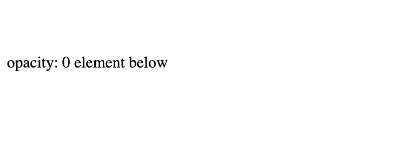</img></kbd>

Chrome finds text in opacity: 0 and opacity: 0.01 cases. It does not find
results in other cases. The matches are scrolled into view, but the highlights
are not visible.

#### Firefox results

<kbd></img></kbd>

Firefox finds text in opacity: 0 and opacity: 0.01 cases. It does not find
results in other cases. The matches are scrolled into view but the highlights
are not visible.

#### Safari results

<kbd></img></kbd>

Safari finds text in opacity: 0 and opacity: 0.01 cases. It does not find
results in other cases. The matches are scrolled into view and the highlight is
visible at full opacity (although the match remains invisible).

### Overflow hidden

This test checks whether matches are found when they are clipped out by
overflow: hidden elements.

```
<!doctype html>

<style>
.spacer { height: 1000px }
.container { background: lightblue; height: 100px; overflow: hidden }
</style>

Search for "target"

<div class=spacer></div>

<p>below is an overflow: hidden element with a 1000px tall spacer and a div with text</p>

<div class=container>
  <div class=spacer></div>
  <div>target</div>
</div>

<div class=spacer></div>
<p>first spacer after container ends here</p>
<div class=spacer></div>
<p>second spacer after container ends here</p>
```

Searching for "target" without quotes.

#### Chrome results

<kbd>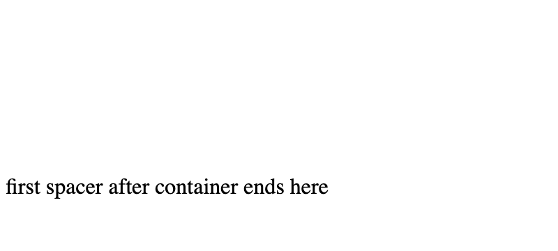</img></kbd>

Chrome finds the match, and scrolls the page to where the match would have been
if it was visible. Neither the match nor the highlight are visible.

#### Firefox results

<kbd>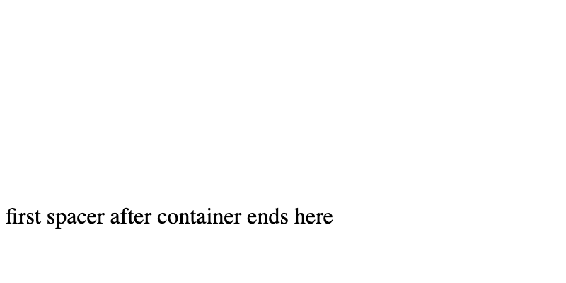</img></kbd>

Firefox finds the match, and scrolls the page to where the match would have
been if it was visible. Neither the match nor the highlight are visible.

#### Safari results

<kbd>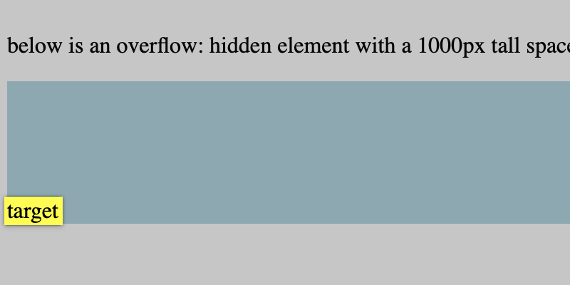</img></kbd>

Safari finds the match, it scrolls the overflow: hidden container's contents to
expose the match, and it scrolls the page to expose the container. Both the
match and the highlight are visible.

### Overflow auto

This test ensures that find-in-page scrolls nested scrollers to expose matches
not visible, but reachable by the user.

```
<!doctype html>

<style>
.spacer { height: 1000px }
.container { background: lightblue; height: 100px; overflow: auto }
</style>

Search for "target"

<div class=spacer></div>

<p>below is an overflow: auto element with a 1000px tall spacer and a div with text</p>

<div class=container>
  <div class=spacer></div>
  <div>target</div>
</div>

<div class=spacer></div>
<p>first spacer after container ends here</p>
<div class=spacer></div>
<p>second spacer after container ends here</p>
```

Searching for "target" without quotes.

#### Chrome results

<kbd>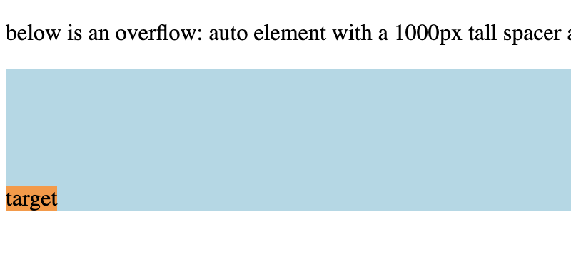</img></kbd>

Chrome finds the match, it scrolls the overflow: auto container's contents to
expose the match, and it scrolls the page to expose the container. Both the
match and the highlight are visible.

#### Firefox results

<kbd>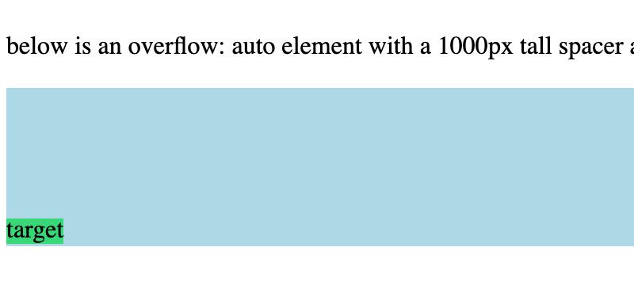</img></kbd>

Firefox finds the match, it scrolls the overflow: auto container's contents to
expose the match, and it scrolls the page to expose the container. Both the
match and the highlight are visible.

#### Safari results

<kbd>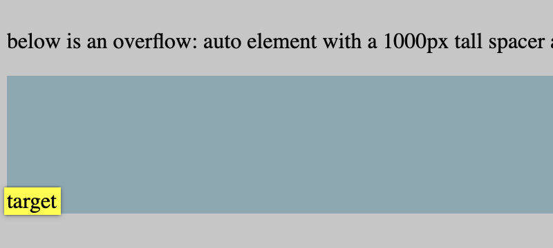</img></kbd>

Safari finds the match, it scrolls the overflow: auto container's contents to
expose the match, and it scrolls the page to expose the container. Both the
match and the highlight are visible.

### Occlusion

This test case checks whether matches can be found if they are occluded by
position: relative and position: absolute elements.

```
<!doctype html>

<style>
.relpos {
  position: relative;
  top: -20px;
  background: lightblue;
  width: 100px;
  height: 20px;
  z-index: 1;
}
.abspos {
  position: absolute;
  top: 0;
  left: 0;
  right: 0;
  bottom: 0;
  background: lightblue;
  z-index: 1;
}
</style>

<p>The "target" text below is occluded by a relpos element<p>

<div>
  target text
  <div class=relpos></div>
</div>

<p>The text below is occluded by a abspos element</p>

<div style="position: relative">
  target text
  <div class=abspos></div>
</div>
```

Searching for "target" without quotes.

#### Chrome results

<kbd>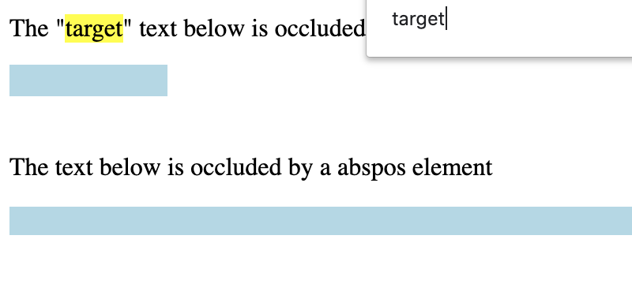</img></kbd>

Chrome finds occluded matches. Neither the highlight nor the match are visible.

#### Firefox results

<kbd></img></kbd>

Firefox finds occluded matches. Neither the highlight nor the match are
visible.

#### Safari results

<kbd>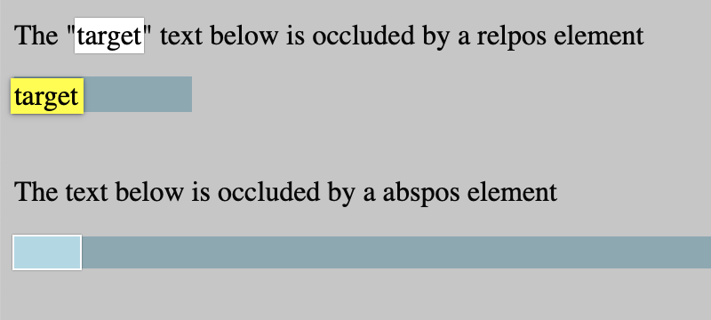</img></kbd>

Safari finds occluded matches. The highlight is always visible. Furthermore,
when the match is the active match, the matched text is also visible on top of
the occluding element.

